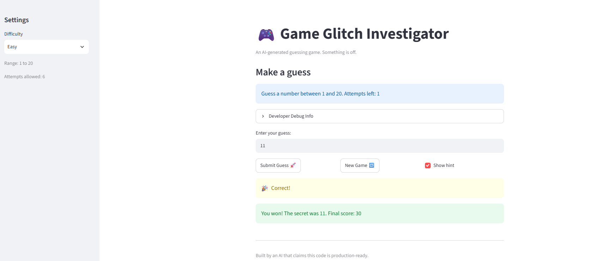

# 🎮 Game Glitch Investigator: The Impossible Guesser

## 🚨 The Situation

You asked an AI to build a simple "Number Guessing Game" using Streamlit.
It wrote the code, ran away, and now the game is unplayable. 

- You can't win.
- The hints lie to you.
- The secret number seems to have commitment issues.

## 🛠️ Setup

1. Install dependencies: `pip install -r requirements.txt`
2. Run the broken app: `python -m streamlit run app.py`

## 🕵️‍♂️ Your Mission

1. **Play the game.** Open the "Developer Debug Info" tab in the app to see the secret number. Try to win.
2. **Find the State Bug.** Why does the secret number change every time you click "Submit"? Ask ChatGPT: *"How do I keep a variable from resetting in Streamlit when I click a button?"*
3. **Fix the Logic.** The hints ("Higher/Lower") are wrong. Fix them.
4. **Refactor & Test.** - Move the logic into `logic_utils.py`.
   - Run `pytest` in your terminal.
   - Keep fixing until all tests pass!

## 📝 Document Your Experience

- [ ] Describe the game's purpose.
The purpose of the game is to guess a randomly generated secret number. The secret number and the number of attempts allowed depend on the selected difficulty level. After each incorrect guess, the game provides a hint to go higher or lower. If the player guesses the secret number correctly, they win the game. 

- [ ] Detail which bugs you found.
The bugs I found included:
1. Incorrect higher/lower hints 
2. The New Game button not properly reinitializing the game 
3. An issue with the attempts count 
4. The number range message at the top not updating when the difficulty level was changed

- [ ] Explain what fixes you applied.
I fixed the four bugs described above, which are higher/lower hints, New Game button reinitializing, attempts count, and number range message at the top. 

## 📸 Demo Walkthrough

Describe your fixed game in numbered steps so a reader can follow along without watching a video:

1. Player guess a number in the range specified, 50. 
2. The hint message says Go LOWER.
3. Player guess 40, the hint says GO HIGHER.
4. Scores, number of attempts, and attempt left are updated.
5. Player wins if guess is correct.
6. Player loses if cannot guess the number within the number of attempts allowed.
7. Click New Game button to play again.

**Screenshot** *(optional)*: <!-- Insert a screenshot of your fixed, winning game here -->


## 🧪 Test Results

```
# Paste your pytest output here, e.g.:
# pytest tests/
# ========================= X passed in 0.XXs =========================
========================= test session starts ==========================
platform win32 -- Python 3.14.2, pytest-9.1.1, pluggy-1.6.0
rootdir: C:\Development\AI110\Projects\ai110-module1show-gameglitchinvestigator-starter
plugins: anyio-4.15.1
collected 6 items                                                       

tests\test_game_logic.py ......                                   [100%]

========================== 6 passed in 0.07s ===========================

```

## 🚀 Stretch Features

- [ ] [If you choose to complete Challenge 4, describe the Enhanced UI changes here — a screenshot is optional]
